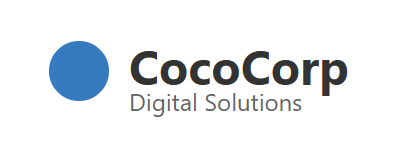
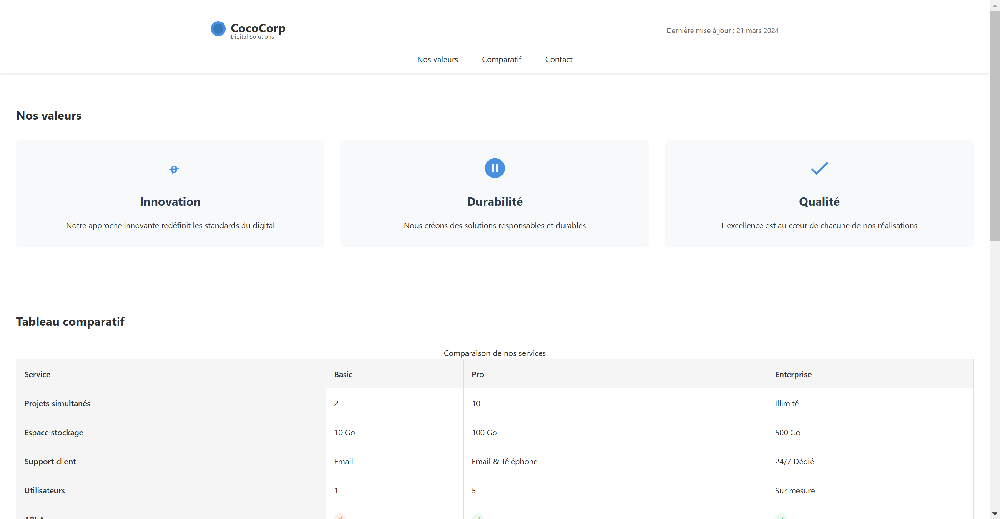
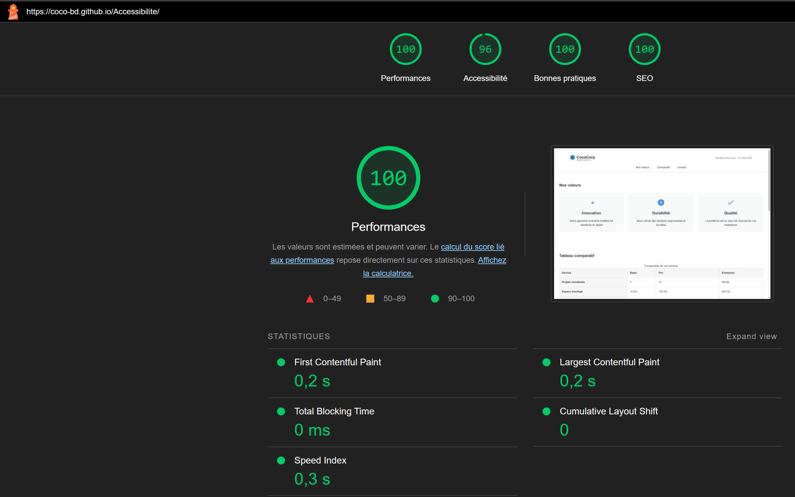
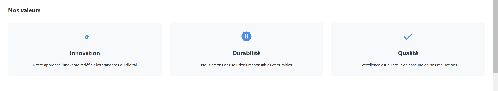
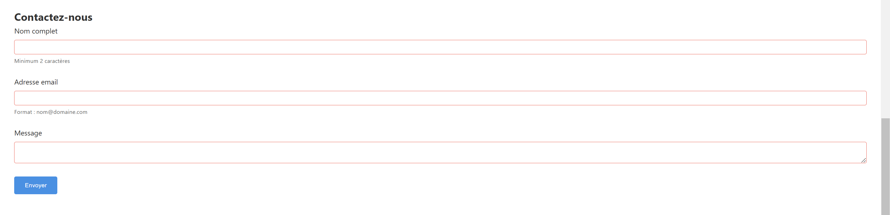

# CocoCorp - Solutions Digitales Responsables 🌱



Une landing page moderne et accessible pour CocoCorp, entreprise spécialisée dans les solutions digitales responsables.

## 📋 Sommaire

- [Aperçu](#aperçu)
- [Fonctionnalités](#fonctionnalités)
- [Technologies utilisées](#technologies-utilisées)
- [Accessibilité](#accessibilité)
- [Installation](#installation)
- [Structure du projet](#structure-du-projet)
- [Captures d'écran](#captures-décran)

## 🎯 Aperçu

CocoCorp est une entreprise innovante proposant des solutions digitales responsables. Ce projet est une landing page qui met en avant :

- Les valeurs de l'entreprise
- Une comparaison détaillée des offres
- Un formulaire de contact accessible



## ✨ Fonctionnalités

- **Design Responsive** : Compatible avec tous les appareils
- **Accessibilité optimisée** : WCAG 2.1 AA compliant
- **Performance optimale** : Utilisation de SVG pour les icônes
- **Formulaire intelligent** : Validation en temps réel
- **Tableau comparatif** : Vue claire des différentes offres
- **Animations subtiles** : Amélioration de l'expérience utilisateur

## 🛠 Technologies utilisées

- HTML5 sémantique
- CSS3 moderne (Flexbox, Grid, Custom Properties)
- SVG pour les icônes et le logo
- Validation de formulaire native
- Pas de dépendances JavaScript

## ♿ Accessibilité




- Navigation au clavier optimisée
- ARIA labels et landmarks
- Contraste des couleurs conforme WCAG
- Structure sémantique HTML5
- Messages d'erreur explicites
- Support des lecteurs d'écran

## 📦 Installation

1. Clonez le repository :

   ```bash
   git clone https://github.com/Coco-Bd/Accessibilite.git
   ```

2. Ouvrez le fichier `index.html` dans votre navigateur.

Sinon vous pouvez directement acceder a la page en ligne : [CocoCorp](https://coco-bd.github.io/Accessibilite/)

## 📸 Captures d'écran

### Page d'accueil


### Section Valeurs



### Tableau comparatif


### Formulaire de contact



### Version mobile


## 📄 Licence

Ce projet est sous licence MIT. Voir le fichier `LICENSE` pour plus de détails.
